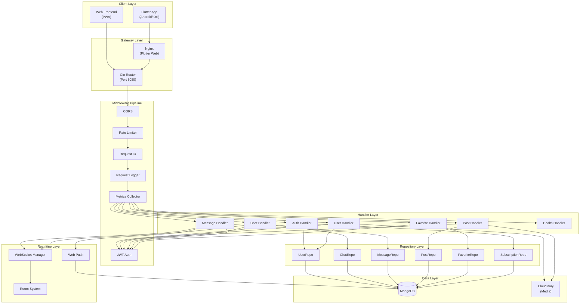
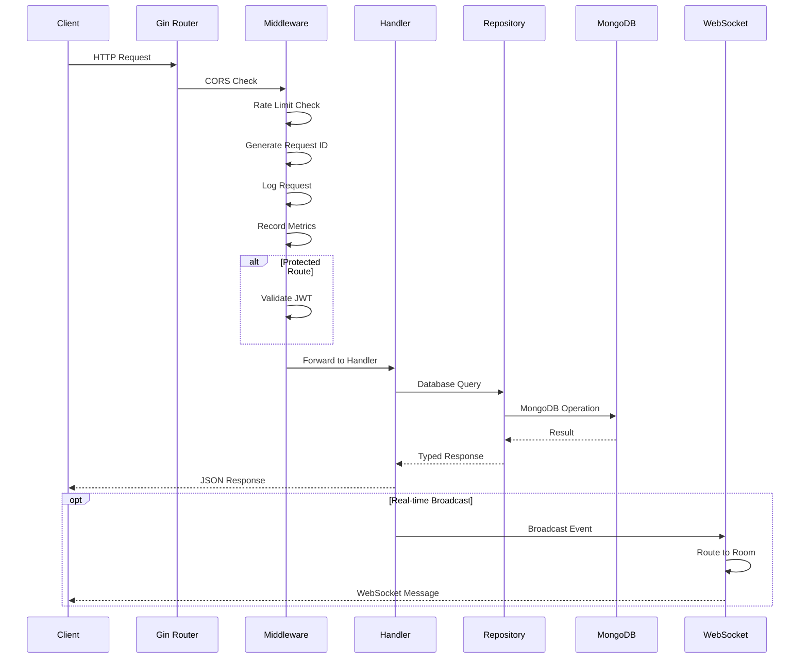
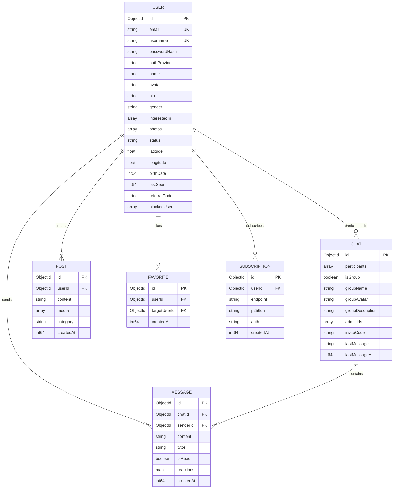
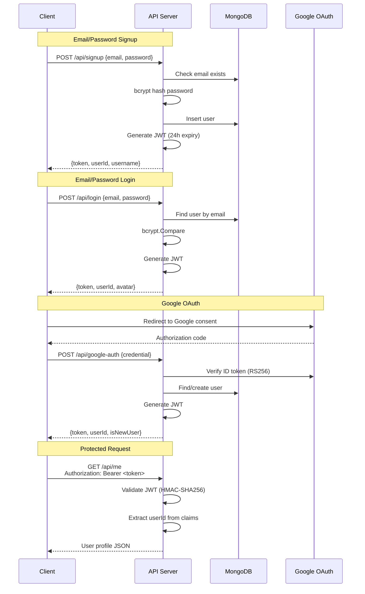
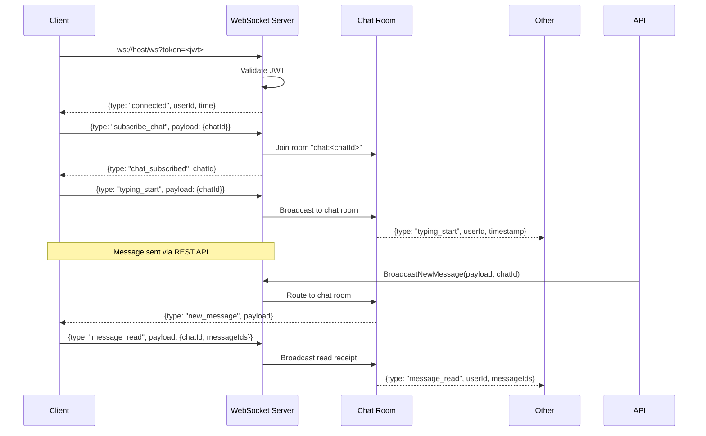

# Zukaping — Real-time Social Connection Platform

[](https://github.com/divineshedrack33220/lemon16/actions/workflows/ci.yml)
[](https://go.dev/)
[](https://flutter.dev/)
[](https://www.mongodb.com/)
[](LICENSE)

Zukaping is a full-stack social networking platform enabling real-time messaging, location-based discovery, and interactive feeds. Built with Go (Gin), Flutter, MongoDB, and WebSockets.

---

## Architecture Overview



---

## Request Lifecycle



---

## Project Structure

```text
lemon16/
├── .github/workflows/     # CI/CD pipelines
│   └── ci.yml             # Lint + Test + Build
│
├── backend/               # Go API server
│   ├── config/            # Environment config loader
│   ├── database/          # MongoDB connection + indexes
│   ├── handlers/          # HTTP request handlers
│   │   ├── auth.go        # Signup, Login
│   │   ├── user.go        # Profile CRUD, nearby, search
│   │   ├── post.go        # Feed, create post
│   │   ├── chat.go        # Chat list, create, group mgmt
│   │   ├── message.go     # Send, read, typing, reactions
│   │   ├── favorite.go    # Like/unlike users
│   │   ├── push.go        # Web Push subscriptions
│   │   ├── google_auth.go # Google OAuth 2.0
│   │   ├── health.go      # Health check + metrics
│   │   └── handler.go     # DI struct
│   ├── internal/testutil/  # Test mocks
│   ├── middleware/         # HTTP middleware
│   │   ├── auth.go        # JWT validation
│   │   ├── ratelimit.go   # Sliding window rate limiter
│   │   ├── logger.go      # Structured request logging
│   │   ├── requestid.go   # X-Request-ID propagation
│   │   └── metrics.go     # Request metrics collector
│   ├── models/            # Data models (9 structs)
│   ├── repository/        # Database access layer
│   │   ├── interfaces.go  # Repository interfaces
│   │   ├── repository.go  # DI aggregator
│   │   ├── user.go        # User CRUD
│   │   ├── chat.go        # Chat operations
│   │   ├── message.go     # Message operations
│   │   ├── post.go        # Post operations
│   │   ├── favorite.go    # Favorite operations
│   │   └── subscription.go# Push subscription ops
│   ├── routes/            # Route definitions
│   ├── websocket/         # WebSocket manager + rooms
│   ├── Dockerfile         # Multi-stage Docker build
│   └── main.go            # Entry point
│
├── mobile_app/            # Flutter application
│   ├── lib/
│   │   ├── main.dart      # App entry + DI init
│   │   ├── models/        # Dart data classes
│   │   ├── screens/       # UI screens (10+)
│   │   ├── services/      # Auth, API, WebSocket
│   │   └── widgets/       # Reusable components
│   ├── assets/            # Logo, images
│   ├── web/               # PWA config + icons
│   ├── Dockerfile         # Flutter web Docker build
│   └── pubspec.yaml       # Dart dependencies
│
├── render.yaml            # Render deployment config
└── README.md              # This file
```

---

## Data Model



---

## Authentication Flow



---

## WebSocket Protocol



### WebSocket Message Types

| Direction | Type | Payload |
|-----------|------|---------|
| Server | `connected` | `{userId, message, time}` |
| Client | `subscribe_chat` | `{chatId}` |
| Server | `chat_subscribed` | `{chatId, userId}` |
| Client | `typing_start` | `{chatId}` |
| Server | `typing_start` | `{chatId, userId, timestamp}` |
| Client | `typing_end` | `{chatId}` |
| Server | `typing_end` | `{chatId, userId, timestamp}` |
| Server | `new_message` | Full message object |
| Client | `message_read` | `{chatId, messageIds}` |
| Server | `message_read` | `{chatId, userId, messageIds, timestamp}` |
| Server | `message_reaction` | `{messageId, chatId, userId, emoji, reactions}` |
| Client | `ping` | — |
| Server | `pong` | `{time}` |

---

## API Endpoints

### Public (No Auth)

| Method | Endpoint | Description |
|--------|----------|-------------|
| `POST` | `/api/signup` | Register with email/password |
| `POST` | `/api/login` | Login with email/password |
| `POST` | `/api/google-auth` | Login with Google credential |
| `GET` | `/api/google/auth-url` | Get Google OAuth redirect URL |
| `GET` | `/api/google/callback` | Google OAuth callback |
| `GET` | `/api/vapid-public-key` | Get VAPID public key for push |
| `GET` | `/api/groups/invite/:code` | Get group info by invite code |
| `GET` | `/health` | Health check (DB ping, memory, uptime) |
| `GET` | `/metrics` | Request metrics (internal) |

### Protected (JWT Required)

| Method | Endpoint | Description |
|--------|----------|-------------|
| `GET` | `/api/me` | Get my profile |
| `PUT` | `/api/me` | Update my profile |
| `DELETE` | `/api/me` | Delete my account |
| `PUT` | `/api/me/status` | Update online status |
| `GET` | `/api/me/referral` | Get referral code/link |
| `GET` | `/api/user/:id` | Get user profile by ID |
| `POST` | `/api/block` | Block a user |
| `GET` | `/api/users/nearby` | Discover nearby users (ranked) |
| `GET` | `/api/users/search` | Search users (rate limited) |
| `POST` | `/api/post` | Create a post |
| `GET` | `/api/feed` | Get social feed |
| `GET` | `/api/user/:id/posts` | Get user's posts |
| `GET` | `/api/my/posts` | Get my posts |
| `POST` | `/api/favorite` | Like a user |
| `DELETE` | `/api/favorite` | Unlike a user |
| `GET` | `/api/favorites` | Get my favorites |
| `GET` | `/api/matches` | Get mutual likes |
| `GET` | `/api/chats` | List chats |
| `POST` | `/api/chats` | Create DM or group chat |
| `GET` | `/api/chats/:id` | Get chat details |
| `PUT` | `/api/chats/:id` | Update group chat |
| `POST` | `/api/chats/:id/admin` | Promote to admin |
| `DELETE` | `/api/chats/:id/participants/:userId` | Remove from group |
| `POST` | `/api/chats/:id/invite` | Generate invite code |
| `POST` | `/api/chats/:id/participants` | Add to group |
| `POST` | `/api/groups/join` | Join via invite code |
| `POST` | `/api/message` | Send message |
| `GET` | `/api/messages/:id` | Get messages for chat |
| `POST` | `/api/messages/:id/read` | Mark messages as read |
| `POST` | `/api/typing` | Send typing indicator |
| `POST` | `/api/messages/:id/react` | React to message |
| `POST` | `/api/upload-photo` | Upload photo (Cloudinary) |
| `POST` | `/api/subscribe` | Subscribe to push notifications |

---

## Local Development

### Prerequisites

- Go 1.22+
- Flutter SDK 3.x
- MongoDB 4.4+ (or use the tarball method below)
- (Optional) Cloudinary account
- (Optional) Google Cloud Console project

### Quick Start

```bash
# 1. Clone
git clone https://github.com/divineshedrack33220/lemon16.git
cd lemon16

# 2. Start MongoDB (tarball method — no sudo needed)
curl -fsSL https://fastdl.mongodb.org/linux/mongodb-linux-x86_64-ubuntu2204-7.0.5.tgz | tar -xz -C /tmp
/tmp/mongodb-*/bin/mongod --dbpath /tmp/mongo_data --port 27017 --fork --logpath /tmp/mongod.log

# 3. Start Backend
cd backend
go build -o /tmp/coded-server .
GIN_MODE=debug /tmp/coded-server &

# 4. Start Flutter Web (optional)
cd ../mobile_app
flutter build web --no-tree-shake-icons
python3 -m http.server 8081 --directory build/web

# 5. Open http://localhost:8081
```

### Run Tests

```bash
cd backend
go test ./...          # Run all tests
go test -race ./...    # With race detector
go test -v ./middleware # Verbose, specific package
```

### Environment Variables

| Variable | Required | Default | Description |
|----------|----------|---------|-------------|
| `PORT` | No | `8080` | Server port |
| `GIN_MODE` | No | `release` | `debug`, `release`, or `test` |
| `JWT_SECRET` | **Yes** (release) | `dev-secret-change-in-prod` | HMAC signing key |
| `MONGODB_URI` | No | `mongodb://localhost:27017` | MongoDB connection string |
| `CLOUDINARY_URL` | No | — | Cloudinary URL for media |
| `GOOGLE_CLIENT_ID` | No | — | Google OAuth client ID |
| `GOOGLE_CLIENT_SECRET` | No | — | Google OAuth client secret |
| `VAPID_PUBLIC_KEY` | No | Auto-generated | Web Push public key |
| `VAPID_PRIVATE_KEY` | No | Auto-generated | Web Push private key |
| `SMTP_HOST` | No | — | SMTP server for email notifications |
| `SMTP_PORT` | No | 587 | SMTP port |
| `SMTP_USER` | No | — | SMTP username |
| `SMTP_PASS` | No | — | SMTP password |
| `SMTP_FROM` | No | — | Sender email address |
| `TWILIO_ACCOUNT_SID` | No | — | Twilio SMS account SID |
| `TWILIO_AUTH_TOKEN` | No | — | Twilio auth token |
| `TWILIO_PHONE` | No | — | Twilio phone number for SMS |
| `ALLOWED_ORIGINS` | No | — | Comma-separated CORS origins |
| `RENDER` | No | — | Set on Render.com |

---

## Deployment

### Render (Docker)

The `render.yaml` defines two Docker services:

1. **coded-backend** — Go API server (port 8080)
2. **coded-frontend** — Flutter web via Nginx (port 8081)

Push to `main` branch to trigger auto-deploy via GitHub Actions.

### Docker (Manual)

```bash
# Backend
docker build -t coded-backend -f backend/Dockerfile backend/
docker run -p 8080:8080 -e JWT_SECRET=... -e MONGODB_URI=... coded-backend

# Frontend
docker build -t coded-frontend -f mobile_app/Dockerfile mobile_app/
docker run -p 8081:8081 coded-frontend
```

---

## Testing

| Package | Tests | Coverage |
|---------|-------|----------|
| `middleware` | 13 | JWT auth, rate limiter, request ID |
| `handlers` | 9 | Auth flows, favorites, health check |
| `config` | 5 | Env loading, defaults, validation |
| **Total** | **27** | Core auth + middleware paths |

---

## License

MIT License — see [LICENSE](LICENSE) for details.

---

Built by Divine Shedrack
