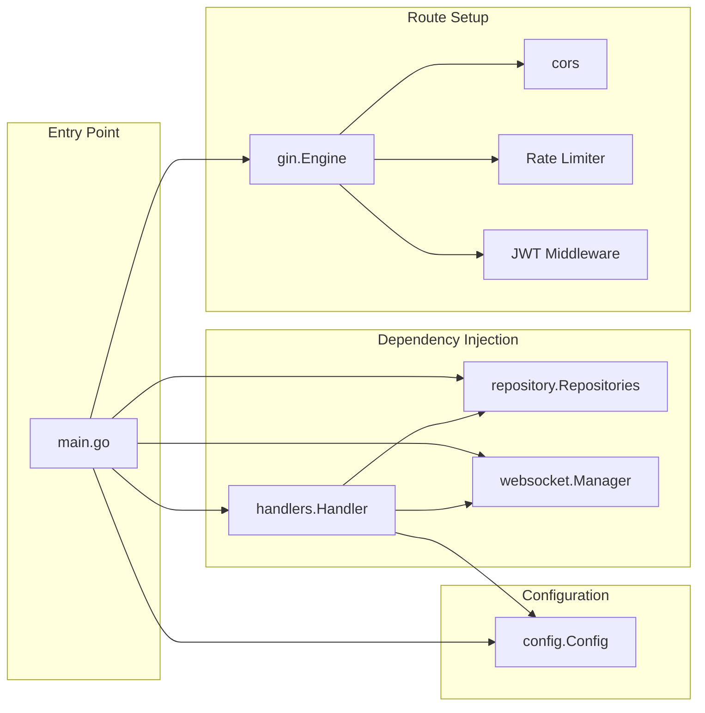
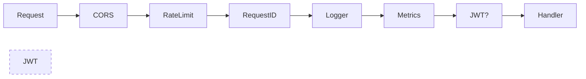

# Zukaping Backend

Go API server built with Gin framework. Serves REST endpoints, WebSocket connections, and health checks.

## Architecture



## Dependency Injection

All dependencies are injected via constructors — no global state (except MongoDB client for nil-db fallback):

```go
// In main.go
repos := repository.New(database.DB)          // Repositories
wsManager := websocket.NewManager()           // WebSocket
h := handlers.NewHandler(repos, wsManager, cfg) // Handler
router := routes.SetupRouter(h, cfg.AllowedOrigins) // Router
```

### Repository Interfaces

Each repository has a corresponding interface for mocking in tests:

```go
type UserRepo interface {
    FindByID(ctx, id) (*User, error)
    FindByEmail(ctx, email) (*User, error)
    Create(ctx, *User) error
    Update(ctx, id, bson.M) (*UpdateResult, error)
    // ... 8 more methods
}
```

## Middleware Pipeline



| Middleware | Purpose |
|-----------|---------|
| CORS | Origin validation with wildcard/port support |
| Rate Limit | Sliding window per-IP (10/min auth, 30/min search) |
| Request ID | Propagates or generates `X-Request-ID` |
| Logger | Structured JSON logging with request context |
| Metrics | Tracks request count, errors, latency |
| JWT Auth | HMAC-SHA256 token validation (protected routes only) |

## Health Check

`GET /health` returns:

```json
{
  "status": {"ok": true},
  "uptime": "2h15m30s",
  "db": {"connected": true, "latency": "ok"},
  "memory": {"alloc_mb": 12.5, "sys_mb": 25.0, "gc_cycles": 42},
  "go_version": "go1.22.0",
  "time": 1721971200
}
```

Returns `503 Service Unavailable` when MongoDB is unreachable.

## Metrics

`GET /metrics` returns:

```json
{
  "total_requests": 1523,
  "error_count": 12,
  "avg_latency_ms": 45.2,
  "status_codes": {"200": 1400, "401": 11, "500": 1},
  "methods": {"GET": 800, "POST": 600, "PUT": 100, "DELETE": 23}
}
```

## Database

- **MongoDB** with connection pooling (MaxPool: 50, MinPool: 5, IdleTimeout: 5m)
- **Retry reads/writes** enabled
- **Indexes**: email (unique), username (unique, sparse), 2dsphere location, compound chat indexes

### Collections

| Collection | Key Indexes |
|------------|-------------|
| `users` | email (unique), username (unique, sparse), location (2dsphere), lastSeen |
| `chats` | participants (unique named), lastMessageAt |
| `messages` | chatId+createdAt (compound), senderId, createdAt |
| `favorites` | userId+targetUserId (unique), createdAt |
| `posts` | userId, createdAt, category |

## WebSocket

Room-based message routing with per-user connection limits:

- Max 5 connections per user
- Ping/pong keepalive (54s interval)
- Graceful shutdown on SIGTERM
- Room join/leave for chat-specific broadcasts

## Running

```bash
# Build
go build -o coded-server .

# Run
GIN_MODE=debug ./coded-server

# Test
go test ./...
go vet ./...
```
