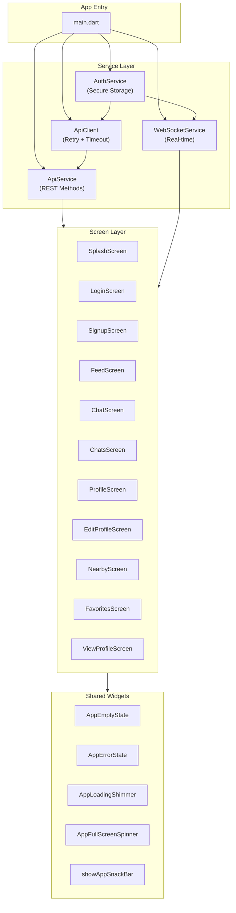

# Zukaping Flutter App

Cross-platform mobile app (Android/iOS) and web PWA built with Flutter.

## Architecture



## Service Layer

### AuthService
- Stores JWT and userId in `flutter_secure_storage`
- Migrates legacy `SharedPreferences` tokens
- Provides `token`, `userId`, `isLoggedIn`, `logout()`

### ApiClient
- HTTP client with automatic retry (3x, exponential backoff)
- Connect timeout: 10s, Request timeout: 15s
- Auto-logout on 401 responses
- Falls back to cache on network errors

### ApiService
- All REST API calls go through `ApiClient`
- No raw `http` package usage anywhere in services/screens
- Methods: `signup()`, `login()`, `getFeed()`, `sendMessage()`, etc.

### WebSocketService
- Auto-reconnect with backoff
- Uses `AuthService` for JWT
- Emits typed events to screens

## Screens

| Screen | Description |
|--------|-------------|
| `SplashScreen` | Auto-login check, redirect to Login or Feed |
| `LoginScreen` | Email/password + Google OAuth |
| `SignupScreen` | Email/password registration |
| `FeedScreen` | Social feed with pull-to-refresh |
| `ChatsScreen` | Chat list with refresh indicator |
| `ChatScreen` | Real-time messaging with typing indicators |
| `ProfileScreen` | View own profile |
| `EditProfileScreen` | Edit name, bio, photos |
| `ViewProfileScreen` | View other user's profile |
| `NearbyScreen` | Location-based user discovery with shimmer loading |
| `FavoritesScreen` | Liked users list |

## Shared Widgets

| Widget | Purpose |
|--------|---------|
| `AppEmptyState` | Empty list placeholder with icon + message |
| `AppErrorState` | Error display with retry button |
| `AppLoadingShimmer` | Shimmer loading skeleton |
| `AppFullScreenSpinner` | Full-screen loading indicator |
| `showAppSnackBar` | Consistent snackbar notifications |

## Project Structure

```text
mobile_app/
├── lib/
│   ├── main.dart
│   ├── models/
│   │   ├── user.dart
│   │   ├── post.dart
│   │   ├── chat.dart
│   │   └── message.dart
│   ├── screens/
│   │   ├── splash_screen.dart
│   │   ├── login_screen.dart
│   │   ├── signup_screen.dart
│   │   ├── feed_screen.dart
│   │   ├── chats_screen.dart
│   │   ├── chat_screen.dart
│   │   ├── profile_screen.dart
│   │   ├── edit_profile_screen.dart
│   │   ├── view_profile_screen.dart
│   │   ├── nearby_screen.dart
│   │   └── favorites_screen.dart
│   ├── services/
│   │   ├── auth_service.dart
│   │   ├── api_client.dart
│   │   ├── api_service.dart
│   │   └── websocket_service.dart
│   └── widgets/
│       └── loading_widget.dart
├── assets/
│   ├── logo.png
│   └── icon-*.png
├── web/
│   ├── index.html
│   ├── manifest.json
│   └── favicon.png
├── Dockerfile
└── pubspec.yaml
```

## Running

```bash
# Dependencies
flutter pub get

# Run on device
flutter run

# Build for web
flutter build web --no-tree-shake-icons

# Analyze
flutter analyze

# Test
flutter test
```
